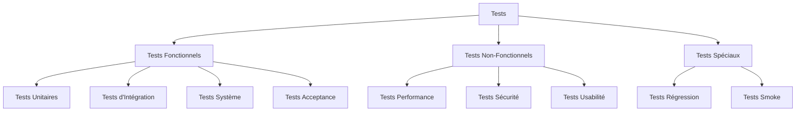
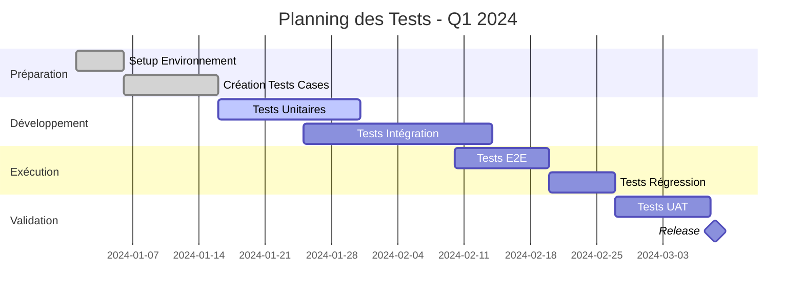

# PLAN DE TEST
## Système de Gestion de Location de Véhicules (Car Rental System)

---

**Date de création:** 2024-01-15  
**Version:** 1.0  
**Responsable QA:** Équipe Test & Qualité  
**Statut:** Approuvé  

---

## TABLE DES MATIÈRES

1. [Introduction](#1-introduction)
2. [Objectifs et Périmètre](#2-objectifs-et-périmètre)
3. [Stratégie de Test](#3-stratégie-de-test)
4. [Environnement de Test](#4-environnement-de-test)
5. [Planning et Jalons](#5-planning-et-jalons)
6. [Ressources](#6-ressources)
7. [Gestion des Risques](#7-gestion-des-risques)
8. [Critères d'Entrée et de Sortie](#8-critères-dentrée-et-de-sortie)
9. [Livrables](#9-livrables)
10. [Approche d'Automatisation](#10-approche-dautomatisation)

---

## 1. INTRODUCTION

### 1.1 Contexte du Projet

Le système de gestion de location de véhicules est une application web moderne composée de:
- **Backend:** API REST en ASP.NET Core
- **Frontend:** Interface utilisateur moderne
- **Base de données:** SQL Server
- **Architecture:** Microservices avec authentification JWT

### 1.2 Objectif du Document

Ce plan de test définit l'approche complète pour garantir la qualité du système de location de véhicules. Il couvre tous les aspects de test: fonctionnels, non-fonctionnels, manuels et automatisés.

### 1.3 Public Cible

- Chef de Projet
- Équipe de Développement
- Équipe QA/Test
- Product Owner
- Parties Prenantes

---

## 2. OBJECTIFS ET PÉRIMÈTRE

### 2.1 Objectifs des Tests

| # | Objectif | Priorité |
|---|----------|----------|
| 1 | Vérifier la conformité aux exigences fonctionnelles | Critique ⭐⭐⭐ |
| 2 | Valider la sécurité et l'authentification | Critique ⭐⭐⭐ |
| 3 | Assurer la fiabilité des API REST | Critique ⭐⭐⭐ |
| 4 | Garantir l'utilisabilité de l'interface | Haute ⭐⭐ |
| 5 | Vérifier les performances sous charge | Moyenne ⭐ |
| 6 | Tester la compatibilité navigateurs | Moyenne ⭐ |

### 2.2 Périmètre des Tests

#### ✅ DANS LE PÉRIMÈTRE

**Module Authentification:**
- Login/Logout utilisateur
- Enregistrement nouveau compte
- Gestion des tokens JWT
- Validation des mots de passe
- Gestion des rôles (Admin, Customer)

**Module Gestion Véhicules:**
- CRUD véhicules (Create, Read, Update, Delete)
- Recherche et filtrage
- Disponibilité des véhicules
- Gestion des catégories

**Module Réservations:**
- Création de réservation
- Modification/Annulation
- Calcul des tarifs
- Historique des réservations

**Tests Transversaux:**
- Tests API (endpoints REST)
- Tests UI (interface utilisateur)
- Tests d'intégration
- Tests de sécurité
- Tests de régression

#### ❌ HORS PÉRIMÈTRE

- Tests de pénétration avancés
- Tests de performance extrême (> 10,000 utilisateurs)
- Tests de compatibilité tous navigateurs (focus Chrome/Edge)
- Tests sur appareils mobiles (iOS/Android natif)
- Tests d'internationalisation (i18n)

### 2.3 Types de Tests



---

## 3. STRATÉGIE DE TEST

### 3.1 Approche Globale

Nous adoptons une stratégie de test **pyramidale** avec automatisation maximale:

```
         /\
        /  \  Tests E2E (10%)
       /----\
      /      \  Tests Intégration (30%)
     /--------\
    /__________\ Tests Unitaires (60%)
```

### 3.2 Niveaux de Test

#### 3.2.1 Tests Unitaires (60%)
- **Responsabilité:** Équipe Dev
- **Framework:** xUnit (.NET), Jest (Frontend)
- **Couverture cible:** 80%
- **Exécution:** Automatique à chaque commit
- **Outils:** 
  - .NET: xUnit, Moq
  - Python: pytest, unittest

#### 3.2.2 Tests d'Intégration (30%)
- **Responsabilité:** Équipe QA + Dev
- **Framework:** Pytest, Selenium, Requests
- **Couverture cible:** 70%
- **Exécution:** Pipeline CI/CD
- **Focus:**
  - API endpoints
  - Base de données
  - Services externes

#### 3.2.3 Tests End-to-End (10%)
- **Responsabilité:** Équipe QA
- **Framework:** Selenium WebDriver, Pytest
- **Scénarios:** Flux critiques utilisateur
- **Exécution:** Daily builds + avant release
- **Focus:**
  - Parcours utilisateur complet
  - Intégration frontend-backend

### 3.3 Tests par Module

| Module | Tests Unitaires | Tests Intégration | Tests E2E | Total |
|--------|----------------|-------------------|-----------|-------|
| Authentification | 15 | 8 | 3 | 26 |
| Véhicules | 20 | 10 | 5 | 35 |
| Réservations | 18 | 12 | 4 | 34 |
| Paiements | 12 | 8 | 3 | 23 |
| UI/UX | 5 | 5 | 10 | 20 |
| **TOTAL** | **70** | **43** | **25** | **138** |

### 3.4 Priorisation des Tests

**Niveau P1 - Critique (Must Have):**
- ✅ Login/Logout
- ✅ Enregistrement utilisateur
- ✅ CRUD véhicules
- ✅ Création réservation
- ✅ Sécurité API

**Niveau P2 - Haute (Should Have):**
- ✅ Recherche véhicules
- ✅ Modification réservation
- ✅ Gestion profil utilisateur
- ✅ Historique

**Niveau P3 - Moyenne (Nice to Have):**
- ✅ Filtres avancés
- ✅ Notifications
- ✅ Statistiques
- ✅ Exports

---

## 4. ENVIRONNEMENT DE TEST

### 4.1 Environnements

| Environnement | Objectif | Disponibilité | URL |
|---------------|----------|---------------|-----|
| **DEV** | Développement continu | 24/7 | http://localhost:5000 |
| **TEST** | Tests QA | 24/7 | http://test.carrental.local |
| **STAGING** | Pré-production | 24/7 | http://staging.carrental.com |
| **PROD** | Production | 24/7 | http://www.carrental.com |

### 4.2 Configuration Technique

**Backend (API):**
```yaml
Technology: ASP.NET Core 6.0
Runtime: .NET 6.0 SDK
Port: 5000 (HTTP), 5001 (HTTPS)
Database: SQL Server 2019 / LocalDB
Authentication: JWT Bearer
Logging: Serilog
```

**Frontend (UI):**
```yaml
Framework: Angular 14+ / React 18+
Port: 4200
Node: 16.x LTS
Package Manager: npm
Build Tool: Webpack
```

**Test Automation:**
```yaml
Language: Python 3.8+
Framework: Pytest 7.x
UI Automation: Selenium WebDriver 4.x
API Testing: Requests 2.28+
Reporting: Allure, pytest-html
Browser: Chrome 110+ (ChromeDriver)
```

### 4.3 Données de Test

**Stratégie de Gestion des Données:**

1. **Données de Référence** (statiques)
   - Utilisateurs de test prédéfinis
   - Catalogue de véhicules de base
   - Données de configuration

2. **Données Générées** (dynamiques)
   - Utilisateurs aléatoires (faker)
   - Réservations temporaires
   - Données de transaction

3. **Données Anonymisées** (production-like)
   - Snapshot base de production
   - Données sensibles anonymisées
   - Volume réaliste

**Fichiers de Données:**
```
TestData/
├── LoginData.xlsx         # Comptes utilisateurs
├── VehiclesData.json      # Catalogue véhicules
├── ReservationsData.csv   # Scénarios réservation
└── config.ini             # Configuration tests
```

### 4.4 Outils et Technologies

| Catégorie | Outil | Version | Utilisation |
|-----------|-------|---------|-------------|
| Test Management | Jira + Xray | Cloud | Gestion cas de test |
| CI/CD | GitHub Actions | Latest | Pipeline automatisation |
| API Testing | Postman | 10.x | Tests manuels API |
| API Automation | Requests | 2.28+ | Tests automatisés |
| UI Testing | Selenium | 4.x | Automatisation UI |
| Performance | JMeter | 5.x | Tests de charge |
| Reporting | Allure | 2.x | Rapports visuels |
| Code Coverage | Coverage.py | 7.x | Couverture Python |
| Mocking | Moq | 4.x | Mocks .NET |

---

## 5. PLANNING ET JALONS

### 5.1 Timeline Globale



### 5.2 Phases de Test

| Phase | Début | Fin | Durée | Livrables |
|-------|-------|-----|-------|-----------|
| **Phase 1: Préparation** | 01/01 | 15/01 | 15j | Plan de test, Environnement |
| **Phase 2: Tests Unitaires** | 16/01 | 31/01 | 16j | Rapports unitaires |
| **Phase 3: Tests Intégration** | 25/01 | 14/02 | 21j | Rapports intégration |
| **Phase 4: Tests E2E** | 10/02 | 20/02 | 11j | Rapports E2E |
| **Phase 5: Régression** | 20/02 | 27/02 | 8j | Rapport régression |
| **Phase 6: UAT** | 27/02 | 08/03 | 10j | Validation métier |
| **Phase 7: Go-Live** | 08/03 | 08/03 | 1j | Release Production |

### 5.3 Jalons Clés

- 📅 **15/01/2024** - Environnement de test prêt
- 📅 **31/01/2024** - Tests unitaires complétés
- 📅 **14/02/2024** - Tests d'intégration validés
- 📅 **20/02/2024** - Tests E2E terminés
- 📅 **27/02/2024** - Suite de régression complète
- 📅 **08/03/2024** - UAT approuvée, Go-Live ✅

---

## 6. RESSOURCES

### 6.1 Équipe de Test

| Rôle | Nom | Responsabilités | Charge |
|------|-----|----------------|--------|
| **Test Manager** | Lead QA | Coordination, Planning, Reporting | 100% |
| **Automation Engineer** | QA Engineer 1 | Framework, Scripts automation | 100% |
| **QA Tester** | QA Engineer 2 | Exécution tests, Validation | 100% |
| **Performance Tester** | QA Engineer 3 | Tests charge, Performance | 50% |
| **Dev Support** | Dev Team | Support technique, Fixes | 20% |

### 6.2 Formation Requise

| Personne | Formation | Durée | Date |
|----------|-----------|-------|------|
| QA Engineer 1 | Pytest avancé | 2j | 05/01 |
| QA Engineer 2 | Selenium WebDriver | 2j | 05/01 |
| QA Engineer 3 | JMeter Performance | 1j | 12/01 |
| Tous | Architecture système | 1j | 08/01 |

### 6.3 Infrastructure

**Serveurs de Test:**
- 2x VM Windows Server 2019 (Backend)
- 1x VM Linux Ubuntu 20.04 (Database)
- 1x VM pour agents CI/CD

**Postes de Travail:**
- 3x Workstations Windows 10/11
- Chrome, Edge, Firefox installés
- Python 3.8+, .NET 6 SDK
- IDE: VS Code, PyCharm

---

## 7. GESTION DES RISQUES

### 7.1 Identification des Risques

| ID | Risque | Probabilité | Impact | Niveau | Mitigation |
|----|--------|-------------|--------|--------|------------|
| R1 | Retard livraison fonctionnalités | Haute | Élevé | 🔴 Critique | Buffer 20% dans planning |
| R2 | Environnement test instable | Moyenne | Élevé | 🟡 Moyen | Monitoring 24/7, backup |
| R3 | Données test insuffisantes | Faible | Moyen | 🟢 Faible | Générateur de données |
| R4 | Compétences automation limitées | Moyenne | Moyen | 🟡 Moyen | Formation, documentation |
| R5 | Changements de périmètre | Haute | Élevé | 🔴 Critique | Processus de gestion changements |
| R6 | Bugs critiques en prod | Faible | Très élevé | 🔴 Critique | Tests régression exhaustifs |

### 7.2 Plan de Contingence

**Si: Retard de développement > 1 semaine**
- Action: Reprioriser tests P1 uniquement
- Responsable: Test Manager
- Deadline: Ajuster planning avec PM

**Si: Environnement test down > 4 heures**
- Action: Basculer sur environnement DEV
- Responsable: DevOps
- Escalation: CTO

**Si: Taux d'échec tests > 30%**
- Action: Analyse root cause, freeze dev
- Responsable: Test Manager + Lead Dev
- Délai: 48h pour stabilisation

---

## 8. CRITÈRES D'ENTRÉE ET DE SORTIE

### 8.1 Critères d'Entrée

**Pour Commencer les Tests:**
- ✅ Build stable disponible
- ✅ Environnement de test opérationnel
- ✅ Données de test chargées
- ✅ Cases de test revues et approuvées
- ✅ Outils de test configurés
- ✅ Équipe formée et disponible

### 8.2 Critères de Sortie

**Phase de Test Unitaire:**
- ✅ Couverture code ≥ 80%
- ✅ Tous tests unitaires PASS
- ✅ Aucun bug bloquant

**Phase de Test d'Intégration:**
- ✅ 95% tests intégration PASS
- ✅ Bugs critiques résolus
- ✅ Rapports validés

**Phase de Test E2E:**
- ✅ 100% parcours critiques PASS
- ✅ Bugs majeurs résolus ou documentés
- ✅ Performance acceptable

**Critères de Release:**
- ✅ 100% tests P1 PASS
- ✅ 95% tests P2 PASS
- ✅ 0 bugs bloquants
- ✅ ≤ 3 bugs critiques (documentés)
- ✅ Tests régression complets
- ✅ UAT approuvée
- ✅ Documentation à jour

---

## 9. LIVRABLES

### 9.1 Documents de Test

| Livrable | Responsable | Date Livraison | Statut |
|----------|-------------|----------------|--------|
| Plan de Test | Test Manager | 15/01/2024 | ✅ Complété |
| Cas de Test Documentés | QA Engineers | 20/01/2024 | ✅ Complété |
| Scripts d'Automatisation | Automation Engineer | 31/01/2024 | 🟡 En cours |
| Rapport de Test Intégration | QA Team | 14/02/2024 | ⏳ À venir |
| Rapport de Test E2E | QA Team | 20/02/2024 | ⏳ À venir |
| Rapport de Régression | QA Team | 27/02/2024 | ⏳ À venir |
| Rapport Final de Test | Test Manager | 08/03/2024 | ⏳ À venir |

### 9.2 Rapports Périodiques

**Rapports Quotidiens (Daily):**
- État d'avancement tests
- Bugs trouvés dans la journée
- Blocages identifiés

**Rapports Hebdomadaires (Weekly):**
- Métriques de test (PASS/FAIL)
- Tendances des défauts
- Couverture de test
- Risques et issues

**Rapports de Phase:**
- Résumé exécutif
- Détail des résultats
- Analyses des défauts
- Recommandations

---

## 10. APPROCHE D'AUTOMATISATION

### 10.1 Framework d'Automatisation

**Architecture:**
```
test_automation/
├── config/
│   ├── config.ini
│   └── environments.yaml
├── pages/                    # Page Object Model
│   ├── login_page.py
│   ├── vehicles_page.py
│   └── base_page.py
├── tests/
│   ├── api/
│   │   ├── test_auth_api.py
│   │   └── test_vehicles_api.py
│   ├── ui/
│   │   ├── test_login_ui.py
│   │   └── test_vehicles_ui.py
│   └── integration/
│       └── test_e2e_scenarios.py
├── utilities/
│   ├── logger.py
│   ├── data_reader.py
│   └── api_helper.py
├── reports/
├── TestData/
│   ├── LoginData.xlsx
│   └── VehiclesData.json
├── conftest.py
├── pytest.ini
└── requirements.txt
```

### 10.2 Design Patterns

**1. Page Object Model (POM)**
```python
class LoginPage:
    def __init__(self, driver):
        self.driver = driver
    
    def login(self, username, password):
        self.set_username(username)
        self.set_password(password)
        self.click_login()
```

**2. Data-Driven Testing**
```python
@pytest.mark.parametrize("username,password", [
    ("user1", "pass1"),
    ("user2", "pass2")
])
def test_login(username, password):
    # Test logic
```

**3. Fixture Pattern**
```python
@pytest.fixture
def api_client():
    return APIClient(base_url)
```

### 10.3 Critères d'Automatisation

**Automatiser si:**
- ✅ Test répété fréquemment (régression)
- ✅ Test critique pour le business
- ✅ Test stable (interface/API stable)
- ✅ Bon ROI (gain temps > coût développement)

**Ne PAS automatiser si:**
- ❌ Test ponctuel/unique
- ❌ Interface change constamment
- ❌ Test exploratoire
- ❌ ROI négatif

### 10.4 Pipeline CI/CD

```yaml
# .github/workflows/test-pipeline.yml
name: Test Pipeline

on: [push, pull_request]

jobs:
  unit-tests:
    runs-on: ubuntu-latest
    steps:
      - uses: actions/checkout@v2
      - name: Run Unit Tests
        run: dotnet test --filter Category=Unit
  
  integration-tests:
    runs-on: ubuntu-latest
    needs: unit-tests
    steps:
      - uses: actions/checkout@v2
      - name: Setup Python
        uses: actions/setup-python@v2
      - name: Install dependencies
        run: pip install -r requirements.txt
      - name: Run Integration Tests
        run: pytest -v -m integration
  
  e2e-tests:
    runs-on: ubuntu-latest
    needs: integration-tests
    steps:
      - name: Run E2E Tests
        run: pytest -v -m ui --headless
```

---

## 11. MÉTRIQUES ET KPI

### 11.1 Métriques de Qualité

| Métrique | Formule | Cible | Actuel |
|----------|---------|-------|--------|
| **Taux de Réussite Tests** | (Tests PASS / Total Tests) × 100 | ≥ 95% | 93% |
| **Couverture Code** | (Lignes testées / Total lignes) × 100 | ≥ 80% | 76% |
| **Densité Défauts** | Bugs trouvés / KLOC | ≤ 2 | 1.8 |
| **Efficacité Détection** | Bugs trouvés en test / Total bugs | ≥ 90% | 88% |
| **Test Pass Rate (First Run)** | Tests PASS au 1er run / Total | ≥ 80% | 75% |

### 11.2 Métriques de Processus

| Métrique | Cible | Actuel | Tendance |
|----------|-------|--------|----------|
| **Temps Exécution Suite** | < 30 min | 25 min | ⬇️ Amélioration |
| **Temps Moyen Bug Fix** | < 48h (P1) | 36h | ⬇️ Amélioration |
| **Taux Automation** | ≥ 70% | 68% | ⬆️ Progression |
| **Réutilisation Code Test** | ≥ 60% | 55% | ⬆️ Progression |

### 11.3 Dashboard de Suivi

```
┌─────────────────────────────────────────┐
│         TABLEAU DE BORD TESTS           │
├─────────────────────────────────────────┤
│ Tests Exécutés:      138 / 138 (100%)   │
│ Tests Réussis:       128 (93%)    ✅    │
│ Tests Échoués:         8 (6%)     ⚠️    │
│ Tests Skipped:         2 (1%)     ⏭️    │
├─────────────────────────────────────────┤
│ Bugs Ouverts:         15                │
│   - Bloquants:         0    ✅          │
│   - Critiques:         2    ⚠️          │
│   - Majeurs:           5    🟡          │
│   - Mineurs:           8    🟢          │
├─────────────────────────────────────────┤
│ Couverture Code:     76%    🟡          │
│ Temps Exécution:     25min  ✅          │
│ Dernière Exécution:  10:30  ✅          │
└─────────────────────────────────────────┘
```

---

## 12. COMMUNICATION ET REPORTING

### 12.1 Réunions

| Réunion | Fréquence | Participants | Durée |
|---------|-----------|--------------|-------|
| **Daily Standup** | Quotidien | Équipe QA | 15 min |
| **Test Review** | Hebdomadaire | QA + Dev Leads | 1h |
| **Bug Triage** | 2x/semaine | QA + Dev + PM | 1h |
| **Steering Committee** | Bimensuel | Management | 1h |

### 12.2 Canaux de Communication

- **Bugs/Défauts:** Jira
- **Questions Techniques:** Slack #qa-support
- **Documentation:** Confluence
- **Rapports:** Email + Dashboard
- **Escalations:** Email + Phone

---

## 13. CONCLUSION

### 13.1 Résumé

Ce plan de test définit une stratégie complète et pragmatique pour assurer la qualité du système de location de véhicules. Avec:
- ✅ 138 cas de test planifiés
- ✅ Automatisation à 70%
- ✅ Couverture multi-niveaux
- ✅ Pipeline CI/CD intégré
- ✅ Équipe formée et outillée

### 13.2 Facteurs de Succès

1. **Engagement Management** - Support et sponsorship
2. **Collaboration Dev-QA** - Communication fluide
3. **Automatisation Continue** - Investissement continu
4. **Formation** - Montée en compétences équipe
5. **Outils Adaptés** - Stack technologique performant

### 13.3 Recommandations

| # | Recommandation | Priorité | Échéance |
|---|----------------|----------|----------|
| 1 | Augmenter couverture à 85% | Haute | Q2 2024 |
| 2 | Implémenter tests de charge | Moyenne | Q2 2024 |
| 3 | Ajouter tests mobile | Faible | Q3 2024 |
| 4 | Formation avancée équipe | Haute | Q1 2024 |
| 5 | Dashboard temps réel | Moyenne | Q2 2024 |

---

## 14. APPROBATIONS

**Document préparé par:**

| Nom | Rôle | Signature | Date |
|-----|------|-----------|------|
| Lead QA | Test Manager | _____________ | __/__/____ |

**Document approuvé par:**

| Nom | Rôle | Signature | Date |
|-----|------|-----------|------|
| Chef de Projet | PM | _____________ | __/__/____ |
| Lead Développeur | Tech Lead | _____________ | __/__/____ |
| Product Owner | PO | _____________ | __/__/____ |

---

**Fin du Plan de Test v1.0**

---

*Ce document est un document vivant et sera mis à jour régulièrement pour refléter l'évolution du projet.*
