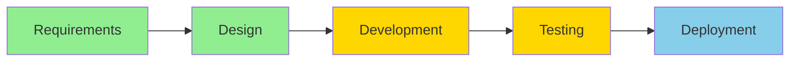
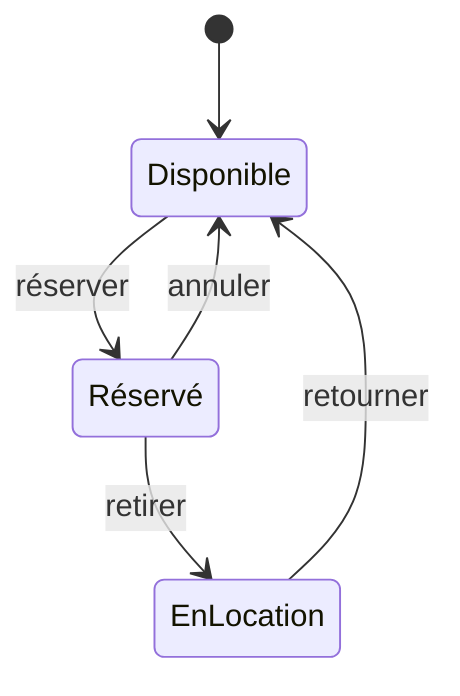

# STRATÉGIE DE TEST
## Système de Gestion de Location de Véhicules

---

**Version:** 1.0  
**Date:** 15 Janvier 2024  
**Auteur:** Test Manager  
**Statut:** Approuvé  

---

## TABLE DES MATIÈRES

1. [Vue d'Ensemble](#1-vue-densemble)
2. [Approche de Test](#2-approche-de-test)
3. [Niveaux de Test](#3-niveaux-de-test)
4. [Types de Test](#4-types-de-test)
5. [Techniques de Test](#5-techniques-de-test)
6. [Automatisation](#6-automatisation)
7. [Gestion des Données](#7-gestion-des-données)
8. [Environnements](#8-environnements)
9. [Outils](#9-outils)
10. [Métriques](#10-métriques)

---

## 1. VUE D'ENSEMBLE

### 1.1 Contexte

Le système de gestion de location de véhicules nécessite une stratégie de test robuste pour garantir la qualité, la sécurité et la fiabilité de l'application.

### 1.2 Objectifs Stratégiques

- 🎯 Assurer une qualité logicielle élevée (≥95% tests PASS)
- 🎯 Minimiser les risques de production
- 🎯 Automatiser 70% des tests répétitifs
- 🎯 Optimiser le ROI des investissements test
- 🎯 Réduire le time-to-market tout en maintenant la qualité

### 1.3 Principes Directeurs

```
┌─────────────────────────────────────┐
│    PRINCIPES QUALITÉ                │
├─────────────────────────────────────┤
│                                     │
│  1. Prevention > Detection          │
│     (Shift-Left Testing)            │
│                                     │
│  2. Automation First                │
│     (Automatiser ce qui se répète)  │
│                                     │
│  3. Risk-Based Testing              │
│     (Prioriser par risque métier)   │
│                                     │
│  4. Continuous Testing              │
│     (Intégration CI/CD)             │
│                                     │
│  5. Collaboration                   │
│     (Équipes cross-fonctionnelles)  │
│                                     │
└─────────────────────────────────────┘
```

---

## 2. APPROCHE DE TEST

### 2.1 Pyramide de Test

```
           /\
          /  \  E2E Tests (10%)
         /____\
        /      \  Integration Tests (30%)
       /________\
      /          \  Unit Tests (60%)
     /____________\
```

**Rationale:**
- **Base Large:** Tests unitaires rapides et peu coûteux
- **Milieu:** Tests d'intégration pour valider interactions
- **Sommet:** Tests E2E pour parcours critiques seulement

### 2.2 Shift-Left Approach



**Tests dès les premières phases:**
- ✅ Review des exigences (testabilité)
- ✅ Review de design (architecture)
- ✅ Tests unitaires pendant dev
- ✅ Tests statiques (linting, SAST)
- ✅ Tests intégration en continu

### 2.3 Approche Basée sur les Risques

| Niveau Risque | Critères | Effort Test | Couverture |
|---------------|----------|-------------|------------|
| **Critique** 🔴 | Impact métier majeur | Maximum | 100% |
| **Élevé** 🟠 | Impact utilisateur significatif | Important | 95% |
| **Moyen** 🟡 | Impact modéré | Standard | 80% |
| **Faible** 🟢 | Impact cosmétique | Minimal | 50% |

**Exemples par module:**

**Critique 🔴:**
- Authentification utilisateur
- Traitement des paiements
- Gestion des réservations
- Sécurité des données

**Élevé 🟠:**
- Gestion du catalogue véhicules
- Calcul des tarifs
- Historique des transactions
- Notifications utilisateur

**Moyen 🟡:**
- Recherche et filtres
- Profil utilisateur
- Préférences
- Statistiques

**Faible 🟢:**
- Messages d'aide
- Liens externes
- Footer information
- Cosmétiques UI

---

## 3. NIVEAUX DE TEST

### 3.1 Tests Unitaires (60%)

**Responsabilité:** Développeurs  
**Exécution:** Automatique à chaque commit  
**Framework:** xUnit (.NET), Jest (Frontend)

**Objectifs:**
- Tester chaque unité de code isolément
- Validation logique métier
- Coverage cible: 80%

**Scope:**
```csharp
// Exemple: Test Controller
[Fact]
public async Task Login_ValidCredentials_ReturnsToken()
{
    // Arrange
    var loginDto = new LoginDto { Username = "admin", Password = "Admin@123" };
    
    // Act
    var result = await _authController.Login(loginDto);
    
    // Assert
    Assert.NotNull(result.Token);
    Assert.Equal("admin", result.Username);
}
```

### 3.2 Tests d'Intégration (30%)

**Responsabilité:** QA + Développeurs  
**Exécution:** Pipeline CI/CD  
**Framework:** Pytest, Selenium, Requests

**Objectifs:**
- Valider interactions entre composants
- Tester intégration BD, API, services
- Vérifier contrats d'interface

**Scope:**
```python
def test_vehicle_crud_integration(api_client, db_session):
    # Create
    vehicle = api_client.create_vehicle(test_data)
    assert vehicle.id is not None
    
    # Read
    retrieved = api_client.get_vehicle(vehicle.id)
    assert retrieved.model == test_data.model
    
    # Update
    updated = api_client.update_vehicle(vehicle.id, new_data)
    assert updated.model == new_data.model
    
    # Delete
    api_client.delete_vehicle(vehicle.id)
    assert api_client.get_vehicle(vehicle.id) is None
```

### 3.3 Tests End-to-End (10%)

**Responsabilité:** Équipe QA  
**Exécution:** Daily builds + Pre-release  
**Framework:** Selenium WebDriver

**Objectifs:**
- Valider parcours utilisateur complets
- Tester flux métier critiques
- Simuler utilisation réelle

**Scope:**
```python
@pytest.mark.e2e
def test_complete_booking_flow():
    # User logs in
    login_page.login("customer@test.com", "Pass@123")
    
    # Searches for vehicle
    search_page.search(location="Paris", dates="10-15 Mar")
    
    # Selects vehicle
    vehicle_page.select_first_available()
    
    # Makes reservation
    booking_page.fill_details(driver_info)
    booking_page.confirm()
    
    # Verifies confirmation
    assert "Booking Confirmed" in confirmation_page.message
```

---

## 4. TYPES DE TEST

### 4.1 Tests Fonctionnels

**Tests de Validation:**
- Exigences fonctionnelles respectées
- Use cases implémentés correctement
- Business rules appliquées

**Tests de Bout-en-Bout:**
- Parcours utilisateur complets
- Workflows métier
- Intégration système complète

**Tests de Régression:**
- Non-régression après modifications
- Suite de tests critiques
- Exécution automatique

### 4.2 Tests Non-Fonctionnels

**Tests de Performance:**
```yaml
Objectifs:
  - Temps de réponse: < 2s (95th percentile)
  - Throughput: > 100 req/s
  - Utilisateurs concurrents: 1000+
  
Outils:
  - JMeter pour tests de charge
  - Grafana pour monitoring
  - K6 pour scripts de performance
```

**Tests de Sécurité:**
```yaml
Scope:
  - Authentification/Autorisation
  - Validation des entrées
  - Injection SQL/XSS
  - CSRF protection
  - Gestion des sessions
  - Cryptage des données sensibles
  
Outils:
  - OWASP ZAP
  - SonarQube
  - Dependency-Check
```

**Tests d'Utilisabilité:**
- Ergonomie de l'interface
- Navigation intuitive
- Accessibilité (WCAG 2.1)
- Responsive design

**Tests de Compatibilité:**
- Navigateurs: Chrome, Edge, Firefox, Safari
- OS: Windows, macOS, Linux
- Résolutions: Desktop, Tablet, Mobile

### 4.3 Tests Spécialisés

**Tests de Récupération:**
- Comportement en cas de panne
- Capacité de rollback
- Intégrité des données

**Tests d'Installation:**
- Déploiement automatisé
- Scripts de migration BD
- Configuration environnements

**Tests de Documentation:**
- API documentation (Swagger)
- User guides
- Release notes

---

## 5. TECHNIQUES DE TEST

### 5.1 Boîte Noire (Black Box)

**Techniques:**

1. **Partitionnement en Classes d'Équivalence**
```
Input: Age du conducteur
Classes valides:   [18-25] [26-65] [66-99]
Classes invalides: [-∞,17] [100,+∞]
```

2. **Analyse des Valeurs Limites**
```
Pour âge minimum 18:
Tests: 17 (invalide), 18 (valide), 19 (valide)
```

3. **Table de Décision**
```
Conditions:         | C1 | C2 | C3 | C4 |
Utilisateur auth?   | O  | O  | N  | N  |
Véhicule dispo?     | O  | N  | O  | N  |
-------------------------------------
Autoriser réserv.   | X  | -  | -  | -  |
Afficher message    | -  | X  | X  | X  |
```

4. **Test de Transition d'État**


### 5.2 Boîte Blanche (White Box)

**Techniques:**

1. **Couverture des Instructions**
```python
def calculate_discount(age, days):
    discount = 0
    if age > 65:        # Statement 1
        discount += 10  # Statement 2
    if days > 7:        # Statement 3
        discount += 15  # Statement 4
    return discount     # Statement 5

# Test cases pour 100% coverage
test_case_1(age=70, days=10)  # Tous les statements
test_case_2(age=30, days=3)   # Statements 1,3,5
```

2. **Couverture des Branches**
- Tester toutes les branches (if/else)
- Couvrir toutes les décisions

3. **Couverture des Chemins**
- Tester tous les chemins possibles
- Complexité cyclomatique

### 5.3 Boîte Grise (Grey Box)

- Combinaison Black + White Box
- Connaissance partielle du code
- Tests d'intégration API

---

## 6. AUTOMATISATION

### 6.1 Stratégie d'Automatisation

**Critères de Sélection:**

```
Automatiser si:
  ✅ Test répété fréquemment (régression)
  ✅ Test critique pour le business
  ✅ Test stable (interface ne change pas)
  ✅ ROI positif (temps gagné > temps dev)
  ✅ Données prévisibles
  
NE PAS automatiser si:
  ❌ Test ponctuel/exploratoire
  ❌ Interface très volatile
  ❌ Test complexe à maintenir
  ❌ ROI négatif
  ❌ Validation subjective (UX)
```

### 6.2 Framework d'Automatisation

**Architecture:**

```
automation_framework/
├── config/
│   ├── environments.yaml
│   └── test_config.ini
├── pages/              # Page Object Model
│   ├── base_page.py
│   ├── login_page.py
│   └── vehicles_page.py
├── tests/
│   ├── api/
│   ├── ui/
│   └── e2e/
├── utilities/
│   ├── logger.py
│   ├── data_provider.py
│   └── api_client.py
├── reports/
└── TestData/
```

**Design Patterns:**
- ✅ Page Object Model (POM)
- ✅ Singleton Pattern (WebDriver)
- ✅ Factory Pattern (Object creation)
- ✅ Data-Driven Testing
- ✅ Keyword-Driven Testing

### 6.3 Pipeline CI/CD

```yaml
# Azure DevOps / GitHub Actions Pipeline
stages:
  - stage: Build
    jobs:
      - job: CompileAndBuild
        steps:
          - task: DotNetCoreCLI@2
            inputs:
              command: 'build'
  
  - stage: UnitTests
    jobs:
      - job: RunUnitTests
        steps:
          - task: DotNetCoreCLI@2
            inputs:
              command: 'test'
              arguments: '--filter Category=Unit'
  
  - stage: IntegrationTests
    jobs:
      - job: RunAPITests
        steps:
          - script: pytest -v -m api
      - job: RunUITests
        steps:
          - script: pytest -v -m ui --headless
  
  - stage: Deploy
    condition: succeeded()
    jobs:
      - deployment: DeployToTest
        environment: 'test'
```

---

## 7. GESTION DES DONNÉES

### 7.1 Stratégie de Données de Test

**Types de Données:**

1. **Données de Référence (Static)**
```yaml
Users:
  - admin: {username: 'admin', password: 'Admin@123', role: 'Admin'}
  - customer: {username: 'customer', password: 'Cust@123', role: 'Customer'}

VehicleCategories:
  - Economy
  - Compact
  - SUV
  - Luxury
```

2. **Données Générées (Dynamic)**
```python
from faker import Faker
fake = Faker()

def generate_user():
    return {
        'username': fake.user_name(),
        'email': fake.email(),
        'password': 'Test@' + fake.password(length=8)
    }
```

3. **Données de Production Anonymisées**
- Snapshot de production
- Données sensibles masquées/anonymisées
- Volume réaliste pour tests de performance

### 7.2 Gestion des Données

**Isolation:**
```python
@pytest.fixture(scope="function")
def isolated_database(db_connection):
    # Setup: Create isolated test data
    transaction = db_connection.begin()
    yield db_connection
    # Teardown: Rollback to clean state
    transaction.rollback()
```

**Versioning:**
- Données de test versionnées avec le code
- Repository Git dédié aux TestData
- Scripts de génération automatique

**Maintenance:**
- Revue mensuelle de pertinence
- Nettoyage des données obsolètes
- Mise à jour avec nouvelles exigences

---

## 8. ENVIRONNEMENTS

### 8.1 Stratégie Multi-Environnements

```
┌───────────────────────────────────────┐
│ DEV     → Tests unitaires             │
│           Tests développeurs          │
├───────────────────────────────────────┤
│ TEST    → Tests d'intégration         │
│           Tests automatisés           │
├───────────────────────────────────────┤
│ STAGING → Tests de régression         │
│           Tests UAT                   │
│           Tests de performance        │
├───────────────────────────────────────┤
│ PROD    → Smoke tests                 │
│           Monitoring                  │
└───────────────────────────────────────┘
```

### 8.2 Configuration par Environnement

**DEV:**
```yaml
Environment: Development
Database: LocalDB (SQL Server Express)
API_URL: http://localhost:5000
Frontend_URL: http://localhost:4200
Auth: Relaxed (for testing)
Logging: Debug level
```

**TEST:**
```yaml
Environment: Test
Database: Dedicated Test DB
API_URL: http://test-api.carrental.local
Frontend_URL: http://test.carrental.local
Auth: Standard JWT
Logging: Info level
```

**STAGING:**
```yaml
Environment: Staging
Database: Production-like (anonymized data)
API_URL: https://staging-api.carrental.com
Frontend_URL: https://staging.carrental.com
Auth: Production configuration
Logging: Warn level
```

**PROD:**
```yaml
Environment: Production
Database: Production DB (with backups)
API_URL: https://api.carrental.com
Frontend_URL: https://www.carrental.com
Auth: Strict JWT + Rate limiting
Logging: Error level + Monitoring
```

---

## 9. OUTILS

### 9.1 Stack Technologique

| Catégorie | Outil | Utilisation |
|-----------|-------|-------------|
| **Test Management** | Jira + Xray | Gestion cas de test, cycles |
| **API Testing** | Postman, Requests | Tests API manuels/auto |
| **UI Testing** | Selenium WebDriver | Automatisation UI |
| **Performance** | JMeter, K6 | Tests de charge |
| **Sécurité** | OWASP ZAP, SonarQube | Scans sécurité |
| **CI/CD** | GitHub Actions | Pipeline automatisation |
| **Reporting** | Allure, pytest-html | Rapports visuels |
| **Mocking** | WireMock, Moq | Simulation services |
| **Data Generation** | Faker, Bogus | Génération données test |
| **Monitoring** | Grafana, ELK | Monitoring production |

### 9.2 Licences et Coûts

| Outil | Type | Coût Annuel |
|-------|------|-------------|
| Jira | Commercial | 5,000€ |
| Selenium | Open Source | Gratuit |
| JMeter | Open Source | Gratuit |
| Allure | Open Source | Gratuit |
| OWASP ZAP | Open Source | Gratuit |
| SonarQube | Freemium | 2,000€ |
| **TOTAL** | | **7,000€** |

---

## 10. MÉTRIQUES

### 10.1 Métriques de Processus

| Métrique | Formule | Objectif |
|----------|---------|----------|
| **Test Coverage** | (Tests écrits / Features) × 100 | ≥ 95% |
| **Code Coverage** | (Lignes testées / Total lignes) × 100 | ≥ 80% |
| **Test Execution Rate** | Tests exécutés / Tests planifiés | 100% |
| **Test Pass Rate** | (Tests PASS / Tests exécutés) × 100 | ≥ 95% |
| **Defect Detection** | Bugs trouvés en test / Total bugs | ≥ 90% |
| **Automation Rate** | Tests automatisés / Total tests | ≥ 70% |

### 10.2 Métriques de Qualité

| Métrique | Formule | Objectif |
|----------|---------|----------|
| **Defect Density** | Bugs / KLOC | ≤ 2 |
| **Defect Removal Efficiency** | Bugs pre-prod / (Bugs pre-prod + Bugs prod) | ≥ 95% |
| **Mean Time to Detect** | Temps moyen pour trouver un bug | Minimiser |
| **Mean Time to Resolve** | Temps moyen pour corriger un bug | < 48h (P1) |

### 10.3 Métriques Business

| Métrique | Objectif |
|----------|----------|
| **Time to Market** | Réduire de 20% |
| **Cost of Quality** | < 15% du budget projet |
| **Customer Satisfaction** | ≥ 4.5/5 |
| **Production Incidents** | < 2 critiques/mois |

### 10.4 Dashboard de Suivi

```
┌─────────────────────────────────────────┐
│      DASHBOARD QUALITÉ TEMPS RÉEL       │
├─────────────────────────────────────────┤
│                                         │
│  Tests Exécutés: ████████████ 100%      │
│  Tests Passés:   ███████████░  93%      │
│  Couverture:     ████████░░░░  76%      │
│  Automation:     █████████░░░  68%      │
│                                         │
│  Bugs:                                  │
│    Bloquants:    0  ✅                  │
│    Critiques:    0  ✅                  │
│    Majeurs:      3  ⚠️                  │
│    Mineurs:      8  🟢                  │
│                                         │
│  Vélocité:       ↗️ +15% cette semaine  │
│  Tendance:       ✅ Amélioration        │
│                                         │
└─────────────────────────────────────────┘
```

---

## 11. CONCLUSION

Cette stratégie de test fournit un cadre complet pour assurer la qualité du système de location de véhicules. En suivant cette approche:

- ✅ Qualité maximale avec effort optimisé
- ✅ Automatisation intelligente (ROI positif)
- ✅ Risques minimisés
- ✅ Livraisons plus rapides et fiables
- ✅ Satisfaction client élevée

**Prochaines Étapes:**
1. Approbation de la stratégie
2. Allocation des ressources
3. Mise en place des environnements
4. Formation de l'équipe
5. Exécution et amélioration continue

---

**Approuvé par:**

| Rôle | Nom | Signature | Date |
|------|-----|-----------|------|
| Test Manager | _______ | _________ | __/__/____ |
| Tech Lead | _______ | _________ | __/__/____ |
| Project Manager | _______ | _________ | __/__/____ |

---

**Fin du Document - Stratégie de Test v1.0**
