# 📋 LIVRABLES DE TEST - CAR RENTAL SYSTEM
## Documentation Complète du Projet de Test

---

**Version:** 1.0  
**Date de Création:** 15 Janvier 2024  
**Dernière Mise à Jour:** 08 Mars 2024  
**Statut:** ✅ Complet et Validé  

---

## 📚 TABLE DES MATIÈRES

1. [Vue d'Ensemble](#vue-densemble)
2. [Liste des Livrables](#liste-des-livrables)
3. [Structure des Documents](#structure-des-documents)
4. [Guide d'Utilisation](#guide-dutilisation)
5. [Conventions et Standards](#conventions-et-standards)
6. [Contacts et Support](#contacts-et-support)

---

## 🎯 VUE D'ENSEMBLE

Ce dossier contient l'ensemble des livrables de test produits durant le cycle de test du système de gestion de location de véhicules. Ces documents constituent la référence complète pour toutes les activités de test, de la planification à l'exécution et au reporting.

### Objectif Global

Fournir une documentation exhaustive et professionnelle pour:
- ✅ **Planifier** les activités de test
- ✅ **Exécuter** les tests de manière structurée
- ✅ **Documenter** les résultats et analyses
- ✅ **Communiquer** avec les parties prenantes
- ✅ **Améliorer** continuellement la qualité

### Périmètre

- **Projet:** Car Rental Management System
- **Version:** 1.0.0
- **Période:** Janvier - Mars 2024
- **Équipe:** QA Team + Dev Team
- **Technologies:** ASP.NET Core, Python/Pytest, Selenium

---

## 📄 LISTE DES LIVRABLES

### 1. Cas de Test Documentés
**📁 Fichier:** `01_CAS_DE_TEST_DOCUMENTES.md`  
**📄 Pages:** ~50  
**✅ Statut:** Complet

**Contenu:**
- 15 cas de test détaillés (TC001 - TC022)
- Module Authentification API (5 tests)
- Module Gestion Véhicules API (5 tests)
- Module Interface UI (3 tests)
- Tests d'Intégration (2 tests)
- Matrice de traçabilité
- Environnement de test
- Métriques de couverture

**Pour qui:**
- Testeurs QA (exécution)
- Développeurs (compréhension des tests)
- Auditeurs (conformité)

---

### 2. Plan de Test
**📁 Fichier:** `02_PLAN_DE_TEST.md`  
**📄 Pages:** ~45  
**✅ Statut:** Approuvé

**Contenu:**
- Objectifs et périmètre des tests
- Stratégie globale de test
- Planning et jalons (Timeline)
- Ressources humaines et matérielles
- Gestion des risques
- Critères d'entrée/sortie
- Livrables attendus
- Approche d'automatisation
- Pipeline CI/CD
- Métriques et KPI

**Pour qui:**
- Chef de Projet (planning)
- Test Manager (coordination)
- Équipe Dev (alignement)
- Management (approbation)

---

### 3. Rapport de Test
**📁 Fichier:** `03_RAPPORT_DE_TEST.md`  
**📄 Pages:** ~55  
**✅ Statut:** Validé pour Production

**Contenu:**
- Résumé exécutif (93% tests PASS)
- Résultats détaillés par module
- Analyse des 23 défauts trouvés
- Métriques de qualité (76% couverture)
- Tests par priorité (100% P1 PASS)
- Risques et issues
- Leçons apprises
- Recommandations finales
- Décision GO/NO-GO
- Approbations signatures

**Pour qui:**
- Management (décision)
- Product Owner (validation)
- Équipe Dev (feedback)
- Clients/Utilisateurs (transparence)

---

### 4. Stratégie de Test
**📁 Fichier:** `04_STRATEGIE_DE_TEST.md`  
**📄 Pages:** ~40  
**✅ Statut:** Approuvé

**Contenu:**
- Approche globale (Pyramide de test)
- Niveaux de test (Unit, Integration, E2E)
- Types de test (Fonctionnel, Performance, Sécurité)
- Techniques de test (Black/White/Grey box)
- Stratégie d'automatisation
- Gestion des données de test
- Environnements multi-tiers
- Outils et technologies
- Métriques de suivi

**Pour qui:**
- Test Manager (référence)
- Équipe QA (guidelines)
- Architectes (alignment technique)
- Nouveaux membres (onboarding)

---

## 📁 STRUCTURE DES DOCUMENTS

### Schéma Hiérarchique

```
Documentation/Livrables/
│
├── README.md (ce fichier)
│   └── Vue d'ensemble et guide
│
├── 01_CAS_DE_TEST_DOCUMENTES.md
│   ├── Introduction
│   ├── Cas de test API
│   ├── Cas de test UI
│   ├── Tests d'intégration
│   └── Matrices de traçabilité
│
├── 02_PLAN_DE_TEST.md
│   ├── Objectifs et périmètre
│   ├── Stratégie de test
│   ├── Planning (Gantt)
│   ├── Ressources
│   └── Gestion des risques
│
├── 03_RAPPORT_DE_TEST.md
│   ├── Résumé exécutif
│   ├── Résultats détaillés
│   ├── Analyse des défauts
│   ├── Métriques
│   └── Recommandations
│
└── 04_STRATEGIE_DE_TEST.md
    ├── Approche de test
    ├── Niveaux et types
    ├── Automatisation
    ├── Outils
    └── Métriques
```

### Standards de Documentation

Tous les documents suivent ces standards:

**✅ Structure:**
- Table des matières cliquable
- Numérotation hiérarchique
- Sections bien délimitées
- Annexes et références

**✅ Format:**
- Markdown (.md) pour portabilité
- Tableaux pour données structurées
- Diagrammes ASCII/Mermaid
- Code blocks avec syntax highlighting

**✅ Présentation:**
- Emojis pour repères visuels
- Codes couleur pour statuts (🔴🟡🟢)
- Checkboxes pour listes (✅❌)
- Graphiques textuels pour données

**✅ Contenu:**
- Langage clair et professionnel
- Terminologie cohérente
- Exemples concrets
- Références croisées

---

## 🚀 GUIDE D'UTILISATION

### Pour les Testeurs QA

**1. Démarrage d'un Cycle de Test:**
```bash
# Lire dans l'ordre
1. Stratégie de Test     → Comprendre l'approche
2. Plan de Test          → Voir le planning
3. Cas de Test           → Exécuter les tests
4. Rapport de Test       → Documenter résultats
```

**2. Exécution des Tests:**
```bash
# Référencer les cas de test
→ 01_CAS_DE_TEST_DOCUMENTES.md

# Suivre les étapes détaillées
→ Section: "Cas de Test - [Module]"

# Documenter les résultats
→ Template fourni dans chaque cas
```

**3. Reporting:**
```bash
# Utiliser le template du rapport
→ 03_RAPPORT_DE_TEST.md

# Remplir les sections
- Résultats par module
- Bugs trouvés
- Métriques actualisées
```

### Pour les Managers

**1. Vue Exécutive Rapide:**
```bash
# Lire les résumés exécutifs
→ 02_PLAN_DE_TEST.md (Section 1)
→ 03_RAPPORT_DE_TEST.md (Résumé Exécutif)

# Consulter les KPI
→ Tableaux de bord dans chaque document
```

**2. Prise de Décision:**
```bash
# Critères GO/NO-GO
→ 03_RAPPORT_DE_TEST.md (Section "Recommandation Finale")

# Analyse des risques
→ 02_PLAN_DE_TEST.md (Section "Gestion des Risques")
```

### Pour les Développeurs

**1. Comprendre les Tests:**
```bash
# Consulter les cas de test
→ 01_CAS_DE_TEST_DOCUMENTES.md

# Voir les exemples de code
→ Chaque cas contient des snippets
```

**2. Corriger les Bugs:**
```bash
# Analyser les défauts
→ 03_RAPPORT_DE_TEST.md (Section "Analyse des Défauts")

# Comprendre les tests échoués
→ Logs et captures d'écran référencés
```

### Pour les Auditeurs

**1. Conformité:**
```bash
# Vérifier la couverture
→ 01_CAS_DE_TEST_DOCUMENTES.md (Matrice de traçabilité)

# Valider le processus
→ 02_PLAN_DE_TEST.md (Processus complet)
→ 04_STRATEGIE_DE_TEST.md (Standards)
```

**2. Preuves:**
```bash
# Rapports d'exécution
→ 03_RAPPORT_DE_TEST.md

# Artefacts de test
→ Logs, screenshots, videos (référencés)
```

---

## 📊 RÉSULTATS CLÉS

### Vue d'Ensemble des Résultats

```
╔═══════════════════════════════════════╗
║     RÉSULTATS GLOBAUX DU PROJET       ║
╠═══════════════════════════════════════╣
║                                       ║
║  Tests Planifiés:        138          ║
║  Tests Exécutés:         138 (100%)   ║
║  Tests Réussis:          128 (93%)    ║
║  Tests Échoués:            8 (6%)     ║
║  Tests Ignorés:            2 (1%)     ║
║                                       ║
║  Bugs Trouvés:            23          ║
║  Bugs Résolus:            21 (91%)    ║
║  Bugs Ouverts:             2 (9%)     ║
║                                       ║
║  Couverture Code:         76%         ║
║  Taux Automation:         68%         ║
║                                       ║
║  STATUT:  ✅ PRÊT POUR PRODUCTION     ║
║                                       ║
╚═══════════════════════════════════════╝
```

### Indicateurs de Qualité

| Métrique | Objectif | Atteint | Statut |
|----------|----------|---------|--------|
| Taux Réussite Tests | ≥ 95% | 93% | 🟡 Proche |
| Couverture Code | ≥ 80% | 76% | 🟡 Proche |
| Bugs Bloquants | 0 | 0 | ✅ OK |
| Bugs Critiques | 0 | 0 | ✅ OK |
| Tests P1 PASS | 100% | 100% | ✅ OK |

**✅ DÉCISION:** Système approuvé pour production avec monitoring renforcé

---

## 📝 CONVENTIONS ET STANDARDS

### Identifiants de Test

**Format:** `TC{XXX}_{description_courte}`

**Exemples:**
- `TC011` - Login avec identifiants valides
- `TC018` - GET tous les véhicules
- `TC_INT_001` - Test d'intégration complet

### Niveaux de Priorité

| Symbole | Niveau | Signification |
|---------|--------|---------------|
| ⭐⭐⭐ | P1 - Critique | Bloquant, doit passer |
| ⭐⭐ | P2 - Haute | Important, prioritaire |
| ⭐ | P3 - Moyenne | Standard, normal |

### Statuts de Test

| Symbole | Statut | Description |
|---------|--------|-------------|
| ✅ | PASS | Test réussi |
| ❌ | FAIL | Test échoué |
| ⏭️ | SKIP | Test ignoré |
| 🟡 | BLOCKED | Test bloqué |
| ⏳ | PENDING | En attente |

### Sévérité des Bugs

| Symbole | Sévérité | Délai Fix |
|---------|----------|-----------|
| 🔴 | Bloquant | Immédiat |
| 🟠 | Critique | < 24h |
| 🟡 | Majeur | < 48h |
| 🟢 | Mineur | < 1 semaine |

---

## 🔄 PROCESSUS D'AMÉLIORATION CONTINUE

### Cycle de Vie des Documents

```mermaid
graph LR
    A[Création] --> B[Revue]
    B --> C[Approbation]
    C --> D[Publication]
    D --> E[Utilisation]
    E --> F[Feedback]
    F --> G[Mise à Jour]
    G --> B
```



### Historique des Versions

| Version | Date | Auteur | Modifications |
|---------|------|--------|---------------|
| 1.0 | 15/01/2024 | QA Team | Création initiale |
| 1.1 | 16/02/2024 | QA Team | Ajout tests intégration |
| 1.2 | 08/03/2024 | QA Team | Rapport final, validation production |

### Demandes de Modification

**Pour proposer des améliorations:**

1. **Créer une Issue:**
```markdown
Titre: [DOC] Amélioration section X dans document Y
Description: Détails de la modification proposée
Labels: documentation, enhancement
```

2. **Soumettre une Pull Request:**
```bash
# Créer une branche
git checkout -b doc/improve-test-cases

# Faire les modifications
# Committer et pusher
git commit -m "docs: amélioration cas de test authentification"
git push origin doc/improve-test-cases

# Créer la PR sur GitHub
```

---

## 🛠️ OUTILS ET RESSOURCES

### Outils Utilisés pour la Documentation

| Outil | Utilisation |
|-------|-------------|
| **Markdown** | Format de documentation |
| **Mermaid** | Diagrammes et flowcharts |
| **VS Code** | Éditeur avec preview |
| **Pandoc** | Conversion vers PDF/Word |
| **Git** | Versioning des documents |

### Ressources Complémentaires

**Dans le Repository:**
```
Documentation/
├── Livrables/           ← Vous êtes ici
├── Guides/              ← Guides techniques
├── Templates/           ← Templates réutilisables
├── Archives/            ← Versions antérieures
└── Assets/              ← Images, diagrammes
```

**Liens Externes:**
- [Confluence] - Wiki du projet
- [Jira] - Suivi des tests et bugs
- [GitHub] - Code source et CI/CD
- [Allure] - Rapports de test automatisés

---

## 👥 CONTACTS ET SUPPORT

### Équipe QA

| Rôle | Nom | Email | Slack |
|------|-----|-------|-------|
| **Test Manager** | [Nom] | test.manager@company.com | @testmanager |
| **QA Lead** | [Nom] | qa.lead@company.com | @qalead |
| **Automation Engineer** | [Nom] | automation@company.com | @autoeng |

### Support

**Questions sur les Documents:**
- 📧 Email: qa-team@company.com
- 💬 Slack: #qa-support
- 📞 Hotline: +33 1 XX XX XX XX

**Problèmes Techniques:**
- 🐛 Jira: Créer un ticket "Support"
- 🔧 GitHub: Ouvrir une issue

**Demandes de Formation:**
- 📚 Contact: training@company.com
- 📅 Sessions régulières tous les mois

---

## 📅 CALENDRIER DE MAINTENANCE

### Révisions Planifiées

| Fréquence | Activité | Responsable |
|-----------|----------|-------------|
| **Hebdomadaire** | Mise à jour statuts tests | QA Engineer |
| **Mensuelle** | Revue métriques et KPI | Test Manager |
| **Trimestrielle** | Révision stratégie | QA Lead + Management |
| **Annuelle** | Audit complet documentation | Quality Manager |

### Prochaines Échéances

- ✅ **15/03/2024** - Patch v1.0.1 avec corrections bugs mineurs
- 📅 **30/03/2024** - Revue post-production
- 📅 **15/04/2024** - Planification tests v1.1
- 📅 **01/06/2024** - Début cycle tests v2.0

---

## ⚖️ LICENCE ET CONFIDENTIALITÉ

**Statut:** Confidentiel - Usage Interne Uniquement

**Restrictions:**
- ❌ Pas de distribution externe
- ❌ Pas de reproduction sans autorisation
- ✅ Usage interne équipes projet uniquement
- ✅ Partage avec parties prenantes autorisées

**Copyright:**
© 2024 [Nom Entreprise]. Tous droits réservés.

---

## 🎓 RESSOURCES D'APPRENTISSAGE

### Pour Débuter

**Nouveaux Testeurs:**
1. Lire: `04_STRATEGIE_DE_TEST.md`
2. Étudier: `01_CAS_DE_TEST_DOCUMENTES.md`
3. Pratiquer: Exécuter les tests TC001-TC003
4. Approfondir: Framework d'automatisation

**Nouveaux Développeurs:**
1. Comprendre: `02_PLAN_DE_TEST.md` (Section Périmètre)
2. Consulter: Tests unitaires dans `01_CAS_DE_TEST_DOCUMENTES.md`
3. Intégrer: Bonnes pratiques testabilité

### Formations Recommandées

- 📚 **Pytest Fundamentals** (2 jours)
- 📚 **Selenium WebDriver Advanced** (3 jours)
- 📚 **API Testing with Postman** (1 jour)
- 📚 **Performance Testing with JMeter** (2 jours)
- 📚 **CI/CD for Test Automation** (2 jours)

---

## 🎯 PROCHAINES ÉTAPES

### Court Terme (Q1 2024)

- [x] Finaliser documentation v1.0
- [x] Valider avec stakeholders
- [x] Publier sur Confluence
- [ ] Session de formation équipe
- [ ] Patch v1.0.1

### Moyen Terme (Q2 2024)

- [ ] Augmenter couverture à 85%
- [ ] Implémenter tests de performance
- [ ] Optimiser suite d'automatisation
- [ ] Planification tests v1.1

### Long Terme (Q3-Q4 2024)

- [ ] Tests application mobile
- [ ] Tests accessibilité (WCAG)
- [ ] Programme qualité global
- [ ] Tests v2.0

---

## 📌 NOTES IMPORTANTES

### ⚠️ Avertissements

- Les données de test doivent être anonymisées
- Ne jamais utiliser données de production réelles
- Respecter les délais de résolution des bugs critiques
- Documenter toutes les modifications

### 💡 Bonnes Pratiques

- ✅ Toujours versionner les documents
- ✅ Mettre à jour les statuts régulièrement
- ✅ Communiquer les blocages rapidement
- ✅ Partager les leçons apprises
- ✅ Célébrer les succès de l'équipe!

---

## 🏆 REMERCIEMENTS

Merci à tous les contributeurs qui ont rendu ce projet possible:

- **Équipe QA** - Pour l'exécution rigoureuse des tests
- **Équipe Dev** - Pour la collaboration et les corrections rapides
- **Product Owner** - Pour les clarifications et la vision
- **Management** - Pour le support et les ressources

---

## 📖 GLOSSAIRE

| Terme | Définition |
|-------|------------|
| **API** | Application Programming Interface |
| **CI/CD** | Continuous Integration / Continuous Deployment |
| **E2E** | End-to-End (test de bout en bout) |
| **JWT** | JSON Web Token (authentification) |
| **KPI** | Key Performance Indicator |
| **POM** | Page Object Model (pattern de test) |
| **ROI** | Return On Investment |
| **UAT** | User Acceptance Testing |
| **UI** | User Interface |

---

## 📞 EN CAS D'URGENCE

**Bugs Bloquants en Production:**
1. 🚨 Contacter: Hotline Support 24/7
2. 📧 Email: urgent@company.com
3. 💬 Slack: @on-call-engineer
4. 📱 Téléphone: +33 1 XX XX XX XX (urgent uniquement)

**Escalation:**
- Niveau 1: QA Engineer → 15 min
- Niveau 2: Test Manager → 30 min
- Niveau 3: CTO → 1h

---

**🎉 Merci d'utiliser cette documentation!**

*Pour toute question, suggestion ou feedback, n'hésitez pas à contacter l'équipe QA.*

---

**Dernière mise à jour:** 08 Mars 2024  
**Prochaine révision:** 08 Avril 2024  
**Version:** 1.0

---

**Fait avec ❤️ par l'équipe QA**
