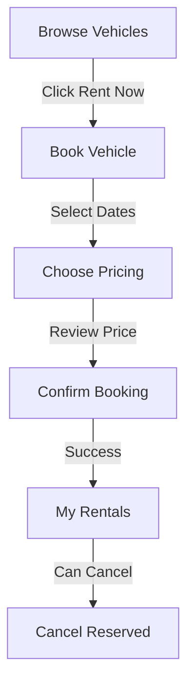

# Quick Reference: Customer vs Admin Rental Flows

## ?? Quick Navigation

### Customer Routes
| Page | Route | Description |
|------|-------|-------------|
| Browse | `/vehicles/browse` | View available vehicles |
| **Book** | `/book-vehicle/{id}` | **NEW: Book a vehicle** |
| My Rentals | `/my-rentals` | View my bookings |
| Profile | `/profile` | View/edit profile |

### Admin Routes
| Page | Route | Description |
|------|-------|-------------|
| Manage Rentals | `/rentals/manage` | View all rentals |
| **Create Rental** | `/rentals/create` | **Admin-only rental creation** |
| Manage Vehicles | `/vehicles/manage` | Manage fleet |
| Customers | `/customers` | View customers |

## ?? Rental Creation Comparison

### Customer Booking (`/book-vehicle`)
```
? CustomerLayout
? Customer auto-identified from JWT
? Simple, focused UI
? Vehicle pre-selection from Browse
? Real-time price updates
? Gradient design
? Redirect to My Rentals

? No customer dropdown
? No admin features
```

### Admin Rental Creation (`/rentals/create`)
```
? AdminLayout
? Select any customer
? Professional admin UI
? Full management features
? Vehicle selection dropdown
? Redirect to Manage Rentals

? Customers cannot access
```

## ?? Security Rules

### Customer Can:
- ? Book vehicles for themselves only
- ? View their own rentals
- ? Cancel their Reserved rentals
- ? Report damage on their rentals
- ? Calculate prices

### Customer Cannot:
- ? Book for other customers (backend overrides)
- ? Cancel Active/Completed rentals
- ? Access admin pages
- ? Complete rentals
- ? Update rental status manually

### Admin/Employee Can:
- ? Create rentals for any customer
- ? View all rentals
- ? Complete any rental
- ? Cancel any rental
- ? Update rental status
- ? Manage vehicles
- ? View all customers

## ?? UI Differences

### Customer Booking Page
- **Layout**: CustomerLayout
- **Style**: Purple gradient header
- **Navigation**: Back to Browse
- **Info Card**: Shows customer name, email, tier
- **Button**: "Confirm Booking - $XXX.XX"
- **Success**: "Booking confirmed!"

### Admin Rental Page
- **Layout**: AdminLayout
- **Style**: Primary color header
- **Navigation**: Back to Manage Rentals
- **Customer Field**: Dropdown (required)
- **Button**: "Create Rental"
- **Success**: "Rental created successfully!"

## ?? Customer Booking Flow



### Step-by-Step
1. **Browse** ? Click "Rent Now" on Tesla Model 3
2. **Book** ? Dates auto-selected (tomorrow + 3 days)
3. **Price** ? $120/day × 3 days = $360
4. **Strategy** ? Choose "Loyalty" ? 10% off = $324
5. **Confirm** ? Click "Confirm Booking - $324.00"
6. **Success** ? Redirect to My Rentals
7. **View** ? See booking status "Reserved"
8. **Cancel** ? Can cancel before pickup

## ?? API Quick Reference

### Customer Booking
```javascript
// Automatic customer ID from JWT
POST /api/rentals
{
  "vehicleId": 1,
  "startDate": "2024-12-10",
  "endDate": "2024-12-15",
  "pricingStrategy": "loyalty"
}
// Response: Rental object with customer ID from token
```

### Admin Booking
```javascript
// Explicit customer ID selection
POST /api/rentals
{
  "customerId": 5,  // Specify customer
  "vehicleId": 1,
  "startDate": "2024-12-10",
  "endDate": "2024-12-15",
  "pricingStrategy": "standard"
}
// Response: Rental object for selected customer
```

## ?? Quick Test Commands

### Test Customer Booking
```bash
# 1. Login as customer
curl -X POST https://localhost:5000/api/auth/login \
  -H "Content-Type: application/json" \
  -d '{"email":"customer@test.com","password":"Test@123"}'

# 2. Book vehicle
curl -X POST https://localhost:5000/api/rentals \
  -H "Authorization: Bearer {TOKEN}" \
  -H "Content-Type: application/json" \
  -d '{"vehicleId":1,"startDate":"2024-12-10","endDate":"2024-12-15","pricingStrategy":"standard"}'

# 3. View my rentals
curl -X GET https://localhost:5000/api/customers/me/rentals \
  -H "Authorization: Bearer {TOKEN}"
```

## ?? Database Quick Checks

### Check Customer Can Book
```sql
-- Verify customer exists
SELECT * FROM Customers WHERE Email = 'customer@test.com';

-- Verify vehicle available
SELECT * FROM Vehicles WHERE Id = 1 AND Status = 0; -- 0 = Available
```

### Check Rental Created
```sql
-- View latest rentals
SELECT TOP 5 
    r.Id, r.Status, r.StartDate, r.EndDate, r.TotalCost,
    c.Email as CustomerEmail, v.Brand + ' ' + v.Model as Vehicle
FROM Rentals r
JOIN Customers c ON r.CustomerId = c.Id
JOIN Vehicles v ON r.VehicleId = v.Id
ORDER BY r.CreatedAt DESC;
```

## ?? Troubleshooting Quick Fix

### "Unable to load customer profile"
```sql
-- Create missing customer record
USE CarRentalDB;
INSERT INTO Customers (FirstName, LastName, Email, PhoneNumber, DriverLicenseNumber, DateOfBirth, RegistrationDate, Tier)
SELECT u.UserName, '', u.Email, '', '', DATEADD(YEAR, -25, GETDATE()), u.CreatedAt, 0
FROM AspNetUsers u
WHERE u.Email = 'customer@test.com'
AND NOT EXISTS (SELECT 1 FROM Customers WHERE Email = u.Email);
```

### "Cannot access page"
- **Check role**: Must be "Customer" for `/book-vehicle`
- **Check role**: Must be "Admin" or "Employee" for `/rentals/create`
- **Solution**: Logout and login again

### "Price not calculating"
- **Check**: Vehicle selected
- **Check**: Valid date range (end > start)
- **Check**: Customer profile loaded
- **Check**: Backend running

## ?? Pro Tips

### For Customers
- Use "Loyalty" strategy for best discounts
- Book on weekends for "Weekend Special" rates
- Cancel Reserved bookings anytime before pickup
- Check My Rentals for all booking history

### For Admins
- Use search/filters in Manage Rentals
- Create bulk bookings from customer list
- Complete rentals immediately after return
- Update status for manual adjustments

## ?? Pricing Strategies

| Strategy | Description | Typical Discount |
|----------|-------------|------------------|
| Standard | Regular pricing | 0% |
| Weekend | Friday-Sunday bookings | 10-15% |
| Seasonal | Based on season/demand | 5-20% |
| Loyalty | Repeat customers | 10% |

## ?? Success Indicators

### Customer Booking Working
? Can navigate from Browse to Book
? Vehicle pre-selected
? Price calculates automatically
? Booking creates successfully
? Appears in My Rentals
? Can cancel Reserved bookings

### Admin Creation Working
? Can select any customer
? Customer dropdown required
? Price calculation works
? Rental created for selected customer
? Redirects to Manage Rentals

## ?? Documentation Links

- **Full Implementation**: `CUSTOMER_SELF_SERVICE_RENTAL.md`
- **Testing Guide**: `TESTING_CUSTOMER_BOOKING.md`
- **Summary**: `CUSTOMER_BOOKING_IMPLEMENTATION_SUMMARY.md`

## ? Key Takeaways

1. **Separate Pages**: `/book-vehicle` for customers, `/rentals/create` for admins
2. **Auto Customer ID**: Backend automatically uses customer ID from JWT token
3. **Security**: Customers cannot book for others or access admin features
4. **UX**: Role-appropriate interfaces for better experience
5. **Cancellation**: Customers can self-cancel Reserved rentals only

---

**Quick Start**: 
1. Login as customer ? Browse vehicles ? Click "Rent Now" ? Book!
2. Login as admin ? Manage Rentals ? Create Rental ? Select customer!
